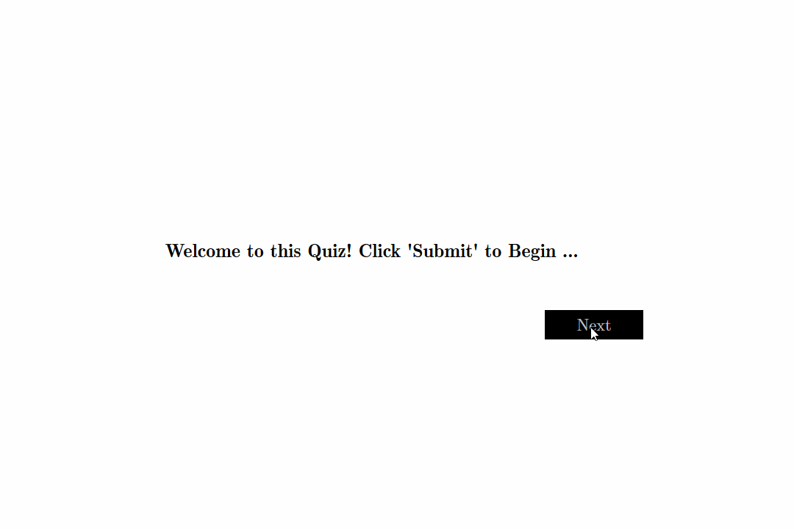

    Copyright (c) 2019
    Author: Chaitanya Tejaswi (github.com/CRTejaswi)    License: GPL v3.0+

## Day 3 - Quiz
An MCQ-type quiz utility.

- The questions, along with their answers are imported from a [JSON file](resources/questions.json).
Quiz questions have been taken from [here](https://trivia.fyi/).

- [x] __NOTE__:
- The program issues an `XMLHttpRequest()`, sending the request to access a local file (`questions.json`).  
Such cross-domain requests are forbidden by default by the __Same-Origin Security Policy__. So, in order to execute the script, you may have to disable the CORS/SOSP option.  
For Firefox, you can follow these steps: `about:config ==> security.fileuri.strict_origin_policy ==> false`.
- Use of `Computer Modern` fonts has been made. To checkout the appearance of these fonts, see [this][CM01], and to download them, visit [this][CM02].

### What's Next?
- [ ] Add a feature that highlights the correct answer even if an incorrect option is chosen.
- [ ] Add separate intro & outro slides (views).
- [ ] Using [this template](resources/questions.md), make the utility more suitable for programming quizzes.
- [ ] Add images and audio-video content to enhance user-experience.
- [ ] Automate the generation of the JSON file, preferably from text files containing questions & answers.
- [ ] Allow user to generate the quiz by simply supplying a CSV file with required fields.  
The JSON file will be generated by a script, and then, imported by the main utility.
- [ ] Publish the utility as a Chrome/Firefox extension.

### Additional Resources: [[1]][RES1] [[2]][RES2]

[CM01]: resources/fonts/cmu.png
[CM02]: http://cm-unicode.sourceforge.net/
[RES1]: https://codepen.io/gcarino/pen/LDgtn
[RES2]: https://codepen.io/andy741231/pen/OXjNAZ